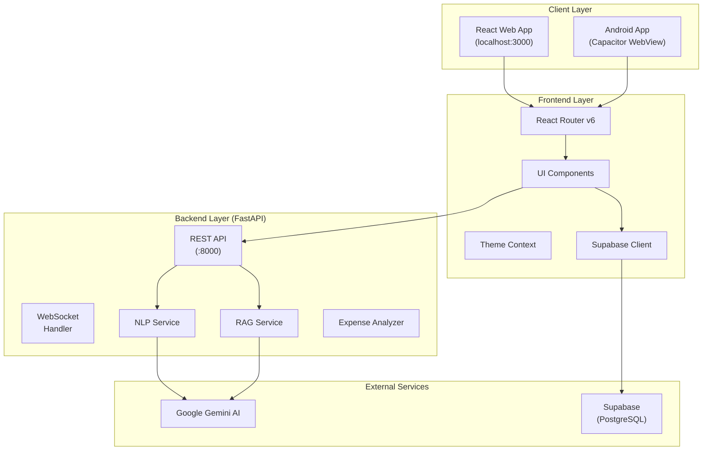
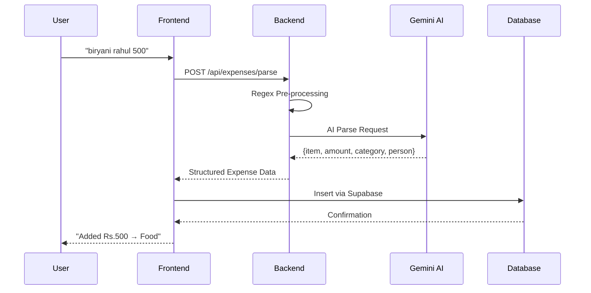
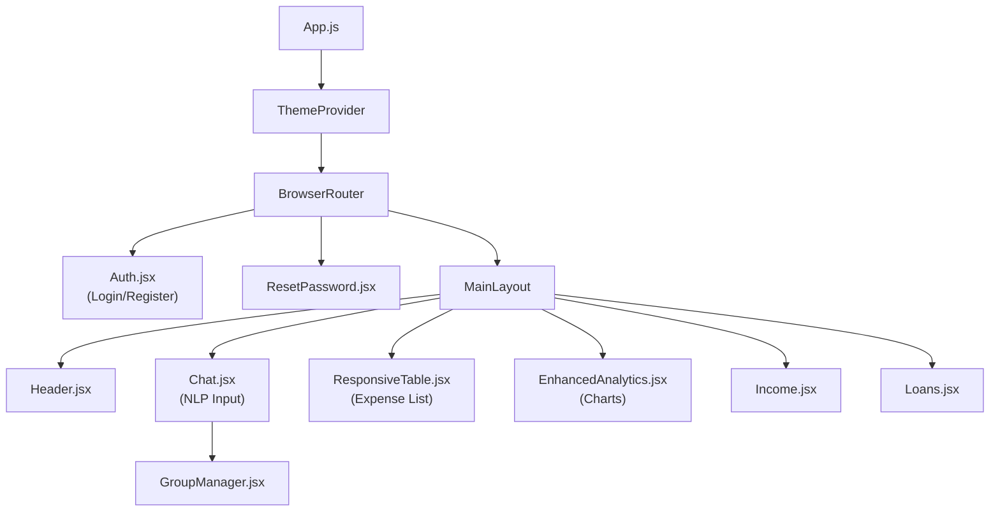
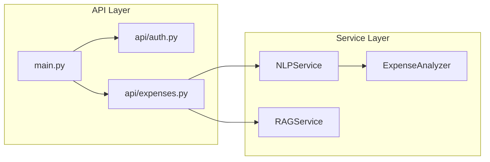
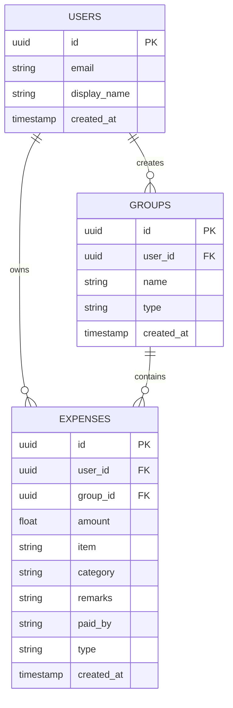
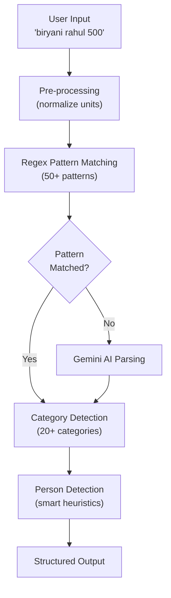
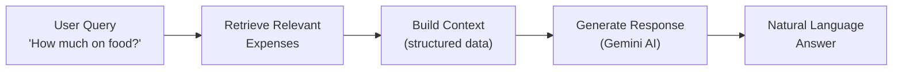

# Personal Finance Manager (PFM)
## Technical Documentation

---

# Executive Summary

**Personal Finance Manager (PFM)** is an AI-powered hybrid mobile application that enables users to track expenses using natural language input. Users can simply type transactions like *"biryani rahul 500"* or *"taxi to airport 1500"*, and the system automatically extracts the amount, categorizes the expense, and identifies any associated parties.

The application combines a **React** frontend with a **FastAPI** backend, leveraging **Google Gemini AI** for intelligent natural language processing and **Supabase** for authentication and data persistence. The mobile experience is delivered through **Capacitor**, enabling native Android deployment from a single codebase.

### Key Metrics

| Component | Details |
|-----------|---------|
| Frontend Components | 18+ React Components |
| Backend Services | 4 Core Python Services |
| NLP Parsing Patterns | 50+ Regex Templates |
| Expense Categories | 20+ Auto-Detection |
| Platform Support | Android + Web |
| AI Model | Google Gemini 2.5 Flash |

---

# Table of Contents

1. [System Architecture](#system-architecture)
2. [Frontend Architecture](#frontend-architecture)
3. [Backend Architecture](#backend-architecture)
4. [Database Design](#database-design)
5. [NLP Processing Pipeline](#nlp-processing-pipeline)
6. [RAG Query System](#rag-query-system)
7. [API Reference](#api-reference)
8. [Environment Configuration](#environment-configuration)
9. [Project Structure](#project-structure)

---

# System Architecture

## High-Level Overview



## Data Flow



---

# Frontend Architecture

## Technology Stack

| Technology | Version | Purpose |
|------------|---------|---------|
| **React** | 18.2 | UI Framework |
| **React Router** | 6.30 | Client-side Routing |
| **TailwindCSS** | 3.3 | Utility-first Styling |
| **Recharts** | 2.8 | Data Visualization |
| **Lucide React** | 0.562 | Icon System |
| **Axios** | 1.6 | HTTP Client |
| **Supabase JS** | 2.38 | Backend Client |
| **Capacitor** | 6.1 | Native Mobile Bridge |

## Component Architecture



## Key Components

| Component | Lines | Responsibility |
|-----------|-------|----------------|
| [Chat.jsx](file:///home/gaurav/workspace/pfm/src/components/Chat.jsx) | ~700 | Natural language expense input, AI responses |
| [GroupManager.jsx](file:///home/gaurav/workspace/pfm/src/components/GroupManager.jsx) | ~1,000 | Multi-group expense management |
| [ResponsiveTable.jsx](file:///home/gaurav/workspace/pfm/src/components/ResponsiveTable.jsx) | ~800 | Sortable, filterable expense table |
| [EnhancedAnalytics.jsx](file:///home/gaurav/workspace/pfm/src/components/EnhancedAnalytics.jsx) | ~500 | Financial charts and insights |
| [Loans.jsx](file:///home/gaurav/workspace/pfm/src/components/Loans.jsx) | ~800 | Loan tracking (lent/borrowed) |

## State Management

The application uses React's built-in state management:

- **Local State**: `useState` for component-specific data
- **Context API**: `ThemeContext` for dark/light mode
- **Supabase Real-time**: Database subscriptions for live updates

---

# Backend Architecture

## Framework: FastAPI

The backend is built with **FastAPI**, providing async REST endpoints and WebSocket support.



## Service Layer

### NLPService ([nlp_service.py](file:///home/gaurav/workspace/pfm/backend/services/nlp_service.py))

The core NLP engine with **1,666 lines** of Python code:

```python
class NLPService:
    def __init__(self):
        self.parser = ExpenseParser()    # Regex-based parser
        self._setup_gemini()              # AI model initialization
        self.rag_service = RAGService()  # Query answering
```

**Key Methods:**

| Method | Description |
|--------|-------------|
| `parse_expense(text)` | Main entry point for parsing expense text |
| `_ai_enhanced_parse(text)` | Uses Gemini for complex parsing |
| `_preprocess_text(text)` | Handles "lakh", "crore", "k" formats |
| `chat_about_expenses(request)` | Answers questions about expenses |

### RAGService ([rag_service.py](file:///home/gaurav/workspace/pfm/backend/services/rag_service.py))

Retrieval-Augmented Generation for intelligent queries:

```python
class RAGService:
    def query_expenses(self, query, expenses_data, user_name):
        context = self._prepare_expense_context(expenses_data, query)
        return self._generate_response(query, context)
```

### ExpenseAnalyzer ([expense_analyzer.py](file:///home/gaurav/workspace/pfm/backend/services/expense_analyzer.py))

Processes natural language queries:

| Method | Description |
|--------|-------------|
| `analyze_expenses(data)` | Compute totals, averages, trends |
| `extract_time_period(query)` | Parse "last week", "this month" |
| `find_specific_item(query, data)` | Locate specific expense items |
| `process_query(query, analysis)` | Natural language query processing |

---

# Database Design

## Platform: Supabase (PostgreSQL)

The application uses **Supabase** as a Backend-as-a-Service, providing:

- PostgreSQL database
- Authentication (email/password, magic link)
- Real-time subscriptions
- Row Level Security (RLS)

## Schema



## Expense Types

| Type | Description | Amount Sign |
|------|-------------|-------------|
| `expense` | Regular expense | Negative |
| `income` | Income received | Positive |
| `loan_given` | Money lent | Positive |
| `loan_taken` | Money borrowed | Negative |
| `loan_repaid` | Loan repayment | Varies |

---

# NLP Processing Pipeline

## Algorithm Overview

The NLP system uses a **hybrid approach** combining regex pattern matching with AI-powered parsing:



## Pattern Matching Examples

```python
# Expense Parser Patterns
patterns = [
    r'(\w+)\s+(\d+)',                    # "momo 100"
    r'(\w+)\s+for\s+(\w+)\s+(\d+)',      # "paid for lunch 500"
    r'paid\s+(\d+)\s+to\s+(\w+)',        # "paid 500 to rahul"
    r'lent\s+(\d+)\s+to\s+(\w+)',        # "lent 5000 to amit"
    r'borrowed\s+(\d+)\s+from\s+(\w+)',  # "borrowed 1000 from bank"
]
```

## Category Detection

The system auto-categorizes expenses using keyword dictionaries:

```python
categories = {
    'Food': ['rice', 'momo', 'biryani', 'burger', 'lunch', 'dinner'],
    'Transport': ['petrol', 'taxi', 'uber', 'bus', 'train', 'flight'],
    'Shopping': ['shirt', 'shoes', 'clothes', 'bag', 'watch'],
    'Utilities': ['electricity', 'water', 'internet', 'phone', 'rent'],
    'Entertainment': ['movie', 'netflix', 'spotify', 'game'],
    'Healthcare': ['medicine', 'doctor', 'hospital', 'pharmacy'],
    # ... 20+ categories
}
```

## Person Detection Algorithm

Smart heuristics to distinguish names from items:

```python
def _is_likely_person(self, word, context=None):
    # Check against known non-person words
    if word.lower() in self.common_items:
        return False
    
    # Check capitalization (proper nouns)
    if word[0].isupper() and len(word) > 2:
        return True
    
    # Check common name patterns
    if word.lower() in self.common_names:
        return True
    
    return False
```

---

# RAG Query System

## How RAG Works

**Retrieval-Augmented Generation (RAG)** combines database retrieval with AI generation:



## Query Processing

```python
async def query_expenses(self, query, expenses_data, user_name):
    # 1. Analyze query intent
    intent = self._analyze_intent(query)
    
    # 2. Retrieve relevant expenses
    if intent == 'item_specific':
        relevant = self._find_item_matches(query, expenses_data)
    else:
        relevant = self._filter_by_category(query, expenses_data)
    
    # 3. Build context for AI
    context = self._prepare_expense_context(relevant, query)
    
    # 4. Generate response with Gemini
    prompt = f"""
    User: {user_name}
    Query: {query}
    Context: {context}
    
    Provide a helpful, accurate response.
    """
    
    return await self._generate_response(prompt)
```

## Supported Query Types

| Query Type | Example | Processing |
|------------|---------|------------|
| Category Total | "How much on food?" | Sum by category |
| Time Period | "Last week's expenses" | Date filtering |
| Specific Item | "Total spent on coffee" | Item matching |
| Comparison | "Food vs Transport" | Multi-category analysis |
| Top Expenses | "Biggest expenses" | Sorting by amount |

---

# API Reference

## Base URL

```
Development: http://localhost:8000
Production: https://your-domain.com/api
```

## Endpoints

### Health Check

```http
GET /health
```

**Response:**
```json
{
  "status": "healthy",
  "message": "Personal Finance Manager API is running",
  "version": "2.0-multi-category-fix"
}
```

### Parse Expense

```http
POST /api/expenses/parse
Content-Type: application/json

{
  "text": "biryani rahul 500",
  "group_id": "uuid-here"
}
```

**Response:**
```json
{
  "expenses": [
    {
      "amount": 500,
      "item": "biryani",
      "category": "Food",
      "remarks": "Spent on Biryani",
      "paid_by": "rahul",
      "type": "expense"
    }
  ],
  "reply": "Added Rs.500 → Food (Spent on Biryani)"
}
```

### Chat Query

```http
POST /api/expenses/chat
Content-Type: application/json

{
  "message": "How much did I spend on food this month?",
  "expenses": [...],
  "user_name": "Gaurav"
}
```

**Response:**
```json
{
  "response": "Hi Gaurav! You've spent Rs.2,500 on food this month across 12 transactions.",
  "data": {
    "total": 2500,
    "count": 12,
    "category": "Food"
  }
}
```

### WebSocket

```javascript
const ws = new WebSocket('ws://localhost:8000/ws');

ws.onmessage = (event) => {
  console.log('Real-time update:', event.data);
};
```

---

# Environment Configuration

## Frontend (`.env`)

```env
# Supabase Configuration
REACT_APP_SUPABASE_URL=https://your-project.supabase.co
REACT_APP_SUPABASE_ANON_KEY=your-anon-key

# API Configuration
REACT_APP_API_BASE_URL=http://localhost:8000
```

## Backend (`backend/.env`)

```env
# Google Gemini AI
GEMINI_API_KEY=your-gemini-api-key

# Supabase Configuration
SUPABASE_URL=https://your-project.supabase.co
SUPABASE_SERVICE_KEY=your-service-role-key

# Server Configuration
PORT=8000
```

---

# Project Structure

```
pfm/
├── src/                          # React Frontend
│   ├── components/               # UI Components (18+)
│   │   ├── Chat.jsx              # NLP input interface
│   │   ├── ResponsiveTable.jsx   # Expense table
│   │   ├── EnhancedAnalytics.jsx # Charts & insights
│   │   ├── GroupManager.jsx      # Multi-group management
│   │   ├── Loans.jsx             # Loan tracking
│   │   └── ...
│   ├── context/                  # React Context
│   │   └── ThemeContext.jsx      # Dark/light mode
│   ├── config/                   # Configuration
│   └── App.js                    # Root component
│
├── backend/                      # FastAPI Backend
│   ├── api/                      # REST Endpoints
│   │   ├── auth.py               # Authentication
│   │   └── expenses.py           # Expense operations
│   ├── services/                 # Business Logic
│   │   ├── nlp_service.py        # NLP processing (1,666 lines)
│   │   ├── rag_service.py        # Query answering (319 lines)
│   │   └── expense_analyzer.py   # Analysis (607 lines)
│   ├── main.py                   # FastAPI app
│   └── requirements.txt          # Python dependencies
│
├── scripts/                      # Development Scripts
│   ├── nlp_tests/                # NLP parsing tests
│   ├── llm_verification/         # LLM integration tests
│   └── utilities/                # Model utilities
│
├── android/                      # Capacitor Android
├── public/                       # Static Assets
├── build/                        # Production Build
│
├── capacitor.config.ts           # Mobile configuration
├── tailwind.config.js            # TailwindCSS config
├── package.json                  # Node dependencies
└── README.md                     # Developer guide
```

---

# Dependency Reference

## Frontend (package.json)

| Package | Version | Purpose |
|---------|---------|---------|
| react | ^18.2.0 | UI framework |
| react-router-dom | ^6.30.1 | Routing |
| @capacitor/core | ^6.1.2 | Mobile bridge |
| @supabase/supabase-js | ^2.38.0 | Backend client |
| axios | ^1.6.0 | HTTP client |
| recharts | ^2.8.0 | Charts |
| tailwindcss | ^3.3.0 | Styling |

## Backend (requirements.txt)

| Package | Version | Purpose |
|---------|---------|---------|
| fastapi | 0.104.1 | Web framework |
| uvicorn | 0.24.0 | ASGI server |
| google-generativeai | >=0.8.0 | Gemini AI SDK |
| supabase | 2.3.4 | Database client |
| python-dotenv | 1.0.0 | Environment loading |
| pydantic | >=2.0.0 | Data validation |

---

*Document Version: 2.0*  
*Last Updated: January 2026*
