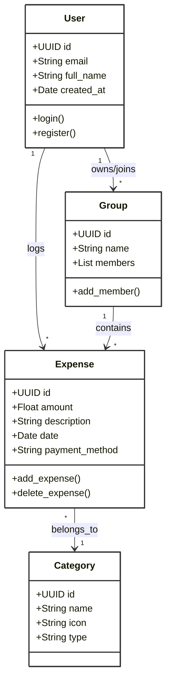
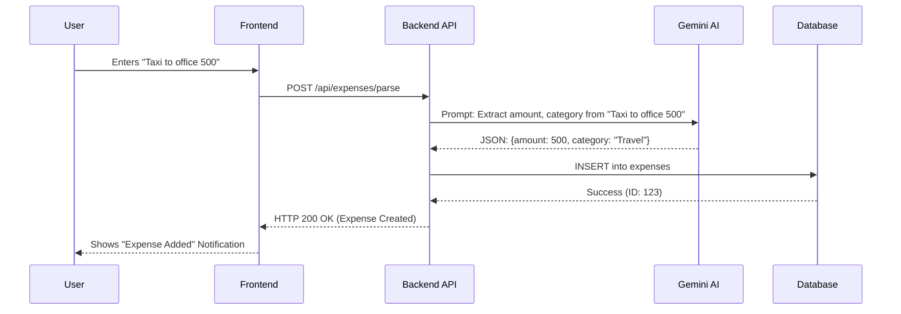
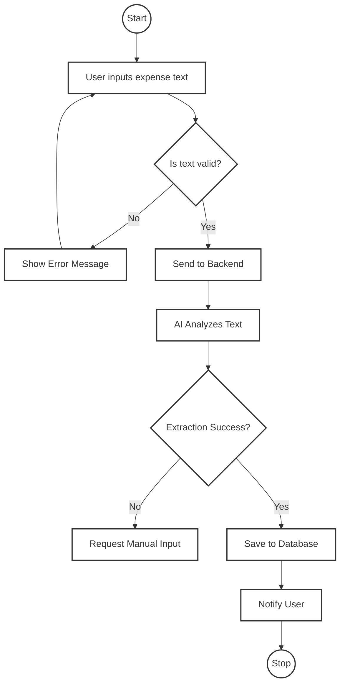
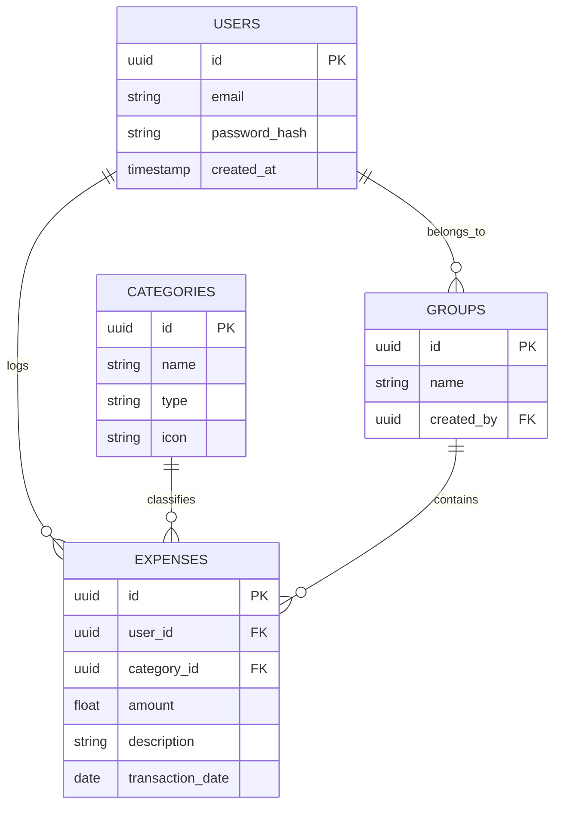

# CHAPTER 4: SYSTEM DESIGN

## 4.1 System Architecture

The system follows a typical **Client-Server Architecture** with a decoupled frontend and backend. The React frontend communicates with the Python (FastAPI) backend via RESTful APIs. The backend handles business logic, communicates with the Google Gemini API for NLP tasks, and interacts with the Supabase PostgreSQL database for data persistence.

```mermaid
graph TD
    User[User] -->|Interacts via Browser/App| Frontend[React Native / Web Frontend]
    Frontend -->|HTTPS/REST API| Backend[FastAPI Backend]
    Backend -->|SQL Queries| DB[(Supabase PostgreSQL)]
    Backend -->|API Calls (Prompt)| Gemini[Google Gemini AI]
    Backend -->|Auth Tokens| Auth[Supabase Auth]
    
    subgraph "External Services"
        Gemini
        Auth
    end
    
    subgraph "Internal Infrastructure"
        Frontend
        Backend
        DB
    end

    style User fill:#fff,stroke:#333,stroke-width:2px
    style Frontend fill:#fff,stroke:#333,stroke-width:2px
    style Backend fill:#fff,stroke:#333,stroke-width:2px
    style DB fill:#fff,stroke:#333,stroke-width:2px
    style Gemini fill:#fff,stroke:#333,stroke-width:2px
    style Auth fill:#fff,stroke:#333,stroke-width:2px
```

## 4.2 Use Case Diagram

The Use Case diagram illustrates the interactions between the primary actor (End User) and the system.

```mermaid
usecaseDiagram
    actor User as "End User"
    
    package "Personal Finance Manager" {
        usecase "Login / Register" as UC1
        usecase "Add Expense (NLP)" as UC2
        usecase "View Dashboard" as UC3
        usecase "Manage Categories" as UC4
        usecase "Generate Reports" as UC5
        usecase "Create Group" as UC6
    }
    
    User --> UC1
    User --> UC2
    User --> UC3
    User --> UC4
    User --> UC5
    User --> UC6

    classDef white fill:#fff,stroke:#333,stroke-width:2px;
    class UC1,UC2,UC3,UC4,UC5,UC6 white;
```

## 4.3 Class Diagram

The Class Diagram depicts the structure of the system's classes, their attributes, and relationships.



## 4.4 Sequence Diagram

The Sequence Diagram for the "Add Expense" feature shows the flow of messages between objects.



## 4.5 Activity Diagram

The Activity Diagram illustrates the workflow of adding an expense.



## 4.6 Database Design (ER Diagram)

The Entity-Relationship (ER) diagram shows the database schema.



## 4.7 UI/UX Design

The user interface was designed with a "Mobile First" approach, ensuring strict adherence to responsive design principles. 
*   **Color Palette:** A clean, minimal color scheme (using TailwindCSS defaults) with distinct colors for income (green) and expense (red).
*   **Typology:** Sans-serif fonts for readability (Inter/Roboto).
*   **Interaction:** Smooth transitions and loading states for AI operations.
