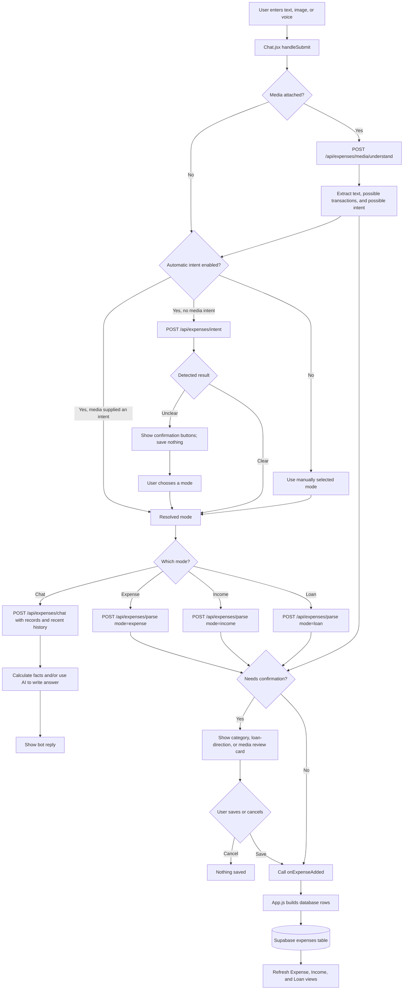
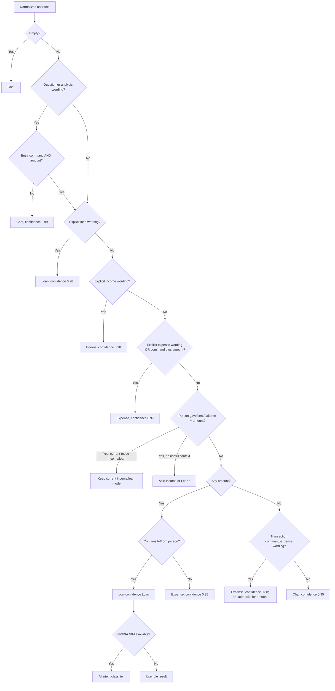
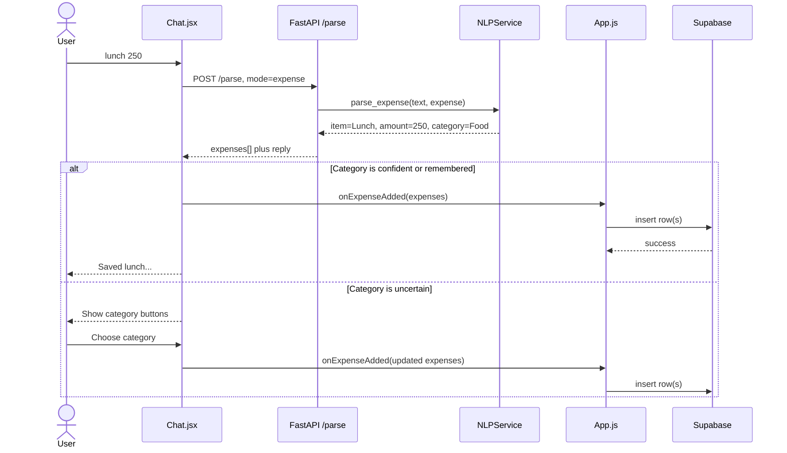
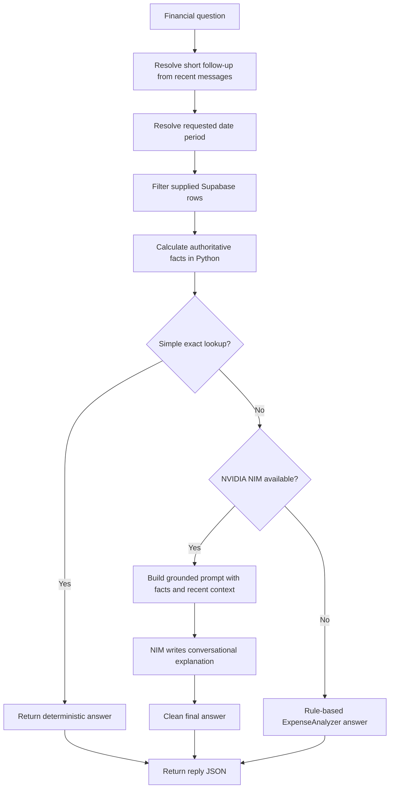

# Chat, Expense, Income, and Loan System: Detailed Guide

This document explains how a message travels through the application, how the app decides what the message means, when it saves a transaction, where data is stored, and how financial chat answers are produced.

The most important idea is:

> The same input box supports four different workflows: **Chat**, **Expense**, **Income**, and **Loan**. Intent detection chooses a workflow. Only the three transaction workflows can save financial rows. Chat mode only reads data and answers questions.

## 1. Main parts of the system

| Part | File | Responsibility |
|---|---|---|
| Chat interface | [`src/components/Chat.jsx`](../src/components/Chat.jsx) | Collects text, image, or voice input; detects intent; calls backend endpoints; shows replies and confirmations |
| App-level save callback | [`src/App.js`](../src/App.js) | Converts parsed transactions into database rows and inserts them into Supabase |
| Supabase client | [`src/supabase.js`](../src/supabase.js) | Connects the browser to Supabase Auth and the database |
| Expense API routes | [`backend/api/expenses.py`](../backend/api/expenses.py) | Exposes `/intent`, `/parse`, `/media/understand`, `/chat`, and voice endpoints |
| NLP service | [`backend/services/nlp_service.py`](../backend/services/nlp_service.py) | Detects intent, parses transaction text, understands media, and coordinates chat answers |
| Financial RAG service | [`backend/services/rag_service.py`](../backend/services/rag_service.py) | Filters relevant rows, calculates exact facts, and optionally asks NVIDIA NIM to explain them |
| Rule-based analyzer | [`backend/services/expense_analyzer.py`](../backend/services/expense_analyzer.py) | Provides totals and useful answers if the AI service is unavailable |
| Category memory | [`src/utils/categoryMemory.js`](../src/utils/categoryMemory.js) | Remembers a user's category correction in browser storage |
| Date parser | [`backend/utils/date_periods.py`](../backend/utils/date_periods.py) | Converts phrases such as “this month” and “last 30 days” into date ranges |

## 2. Whole-system diagram



## 3. What happens before intent detection

The main function is `handleSubmit()` in `Chat.jsx`.

Before deciding the mode, it:

1. Stops the browser's normal form submission.
2. Reads typed text or a programmatic voice/media submission.
3. Rejects an empty submission.
4. Rejects a second submission while another one is loading or audio is still recording.
5. Cleans a spoken transcript by removing filler words, duplicate words, and repeated phrases.
6. Creates a unique message ID.
7. Immediately places the user's message in React state so it appears in the chat.
8. Creates an `AbortController`, allowing processing to be cancelled safely.

For transaction modes, the frontend later checks that the message contains:

- at least one number; and
- at least one word that looks meaningful.

The “real word” check requires letters, at least one vowel, no very long consonant sequence, and a reasonable vowel ratio for longer words. This is a quick frontend guard, not the actual financial parser.

Examples:

| Input | Frontend result before parsing |
|---|---|
| `lunch 250` | Valid transaction-shaped input |
| `lunch` | Rejected in a transaction mode because the amount is missing |
| `250` | Rejected because the item or purpose is missing |
| `xyzqw 250` | May be rejected because it does not look like a real description |

## 4. How automatic intent detection works

### 4.1 Modes and settings

`inputMode` can be one of:

- `chat`
- `expense`
- `income`
- `loan`

The selected mode is saved in browser storage as `pfm_input_mode`.

Automatic intent detection is saved as `pfm_auto_intent_enabled`. It is enabled unless the stored value is exactly `false`.

- **Automatic intent ON:** detection is authoritative, even if a different tab was previously selected.
- **Automatic intent OFF:** the app trusts the manually selected tab.
- **User already answered a confirmation:** the confirmed mode is used, and detection is skipped for that resubmission.

### 4.2 Frontend intent request

If automatic intent is enabled and there is no confirmed choice:

```json
POST /api/expenses/intent
{
  "text": "salary 50000",
  "current_mode": "expense"
}
```

The backend returns a result similar to:

```json
{
  "intent": "income",
  "confidence": 0.98,
  "reason": "income source wording",
  "source": "rules"
}
```

Intent detection **does not save anything**. It only chooses the next workflow.

### 4.3 Backend rule-based decision order

The backend normalizes the text to lowercase and single spaces, then calculates several signals.

#### Amount signal

It looks for a number, optionally written with currency markers such as `Rs`, `रु`, or `NPR`.

Examples: `250`, `Rs. 250`, `NPR 1,500`.

#### Entry-command signal

Words such as:

`add`, `log`, `record`, `save`, `track`, `enter`

#### Question signals

The text is question-like if it:

- contains `?`;
- starts with words such as `how`, `what`, `when`, `who`, `can`, `show`, `tell`, or `compare`;
- contains phrases such as `how much`, `show me`, or `can you`;
- asks for a total, summary, breakdown, average, history, comparison, highest, or lowest value; or
- names a period such as `today`, `this month`, or `last 30 days` without looking like an entry.

A question becomes `chat` with high confidence, except when it is a polite entry command containing an amount. Therefore:

- `How much did I spend this month?` → Chat
- `Can you add lunch 300?` → Expense, because `add` plus `300` clearly asks to create an entry

#### Loan signals

Words and patterns include:

`loan`, `lent`, `lend`, `borrow`, `borrowed`, `owe`, `owes`, `repaid`, `repay`, `returned`, `paid me back`, `got back`, and clear person-to-person transfers.

Loan wording is checked before income and expense wording, so an explicit loan phrase wins.

#### Income signals

Words include:

`salary`, common salary misspellings, `income`, `wage`, `bonus`, `freelance`, `earned`, `dividend`, `commission`, `paycheck`, `got paid`, and `credited`.

#### Expense signals

Words include:

`spend`, `spent`, `bought`, `purchased`, `expense`, `cost`, `shopping`, `bill`, and `paid for`.

An entry command plus an amount is also treated as an expense when no stronger income or loan signal exists.

### 4.4 Exact intent decision tree



### 4.5 When the AI classifier is used

The rule result is returned immediately when:

- it requires user confirmation;
- its confidence is at least `0.85`; or
- NVIDIA NIM is unavailable.

Only a lower-confidence case is sent to the small NVIDIA NIM entry model. The model must return compact JSON with one of the four allowed intents. If the model response is invalid or unavailable, the backend returns the rule-based result.

If the entire `/intent` HTTP call fails in `Chat.jsx`, the frontend chooses `chat`. This protects against accidentally saving a transaction when intent detection is unavailable.

### 4.6 Ambiguous messages

Example: `Ram sent me 500`.

This might mean:

- income or a gift;
- money borrowed from Ram; or
- Ram returning a loan.

If there is no useful selected context, the backend returns `needs_confirmation: true` with `income` and `loan` candidates. `Chat.jsx` displays buttons and saves nothing. When the user chooses, the same original message is resubmitted with `confirmedMode`; the intent classifier is bypassed.

### 4.7 Intent examples

| User message | Expected mode | Why |
|---|---|---|
| `How much did I spend today?` | Chat | Question and time period |
| `Show my food breakdown` | Chat | Analysis request |
| `Can you add coffee 80?` | Expense | Entry command plus amount |
| `coffee 80` | Expense | Item plus amount defaults to expense |
| `bought shoes for 3000` | Expense | Explicit purchase wording |
| `salary 50000` | Income | Explicit income source |
| `freelance payment 15000` | Income | Income keyword |
| `lent 1000 to Ram` | Loan | Explicit lending wording |
| `borrowed 500 from Sita` | Loan | Explicit borrowing wording |
| `Ram paid me back 500` | Loan | Explicit repayment wording |
| `Ram sent me 500` | Confirmation | Could be income, gift, loan, or repayment |
| `record lunch` | Expense, then validation message | Transaction wording but no amount |
| `What should I save each month?` | Chat | Advice question, not a database entry |

## 5. Expense workflow

Example input: `lunch 250`.



### 5.1 Parsing strategy

`POST /api/expenses/parse` calls `NLPService.parse_expense()`.

The parser:

1. Validates the mode.
2. Converts units such as `1.5k`, `2 lakh`, or `1 cr` into numbers.
3. Normalizes known typing mistakes and removes entry-command wording.
4. Tries the low-latency NVIDIA NIM entry model when configured.
5. Requires compact JSON from the model.
6. Normalizes and validates the model's transactions.
7. If AI parsing fails, uses local deterministic parsing.
8. Uses quantity-aware rules so `2ltr petrol 400` means one Rs.400 petrol expense, not a Rs.2 expense.
9. Uses a final simple number-and-item extractor as a last fallback.

It also supports multiple entries, for example:

`rice 300 and petrol 500`

This should produce two rows.

### 5.2 Expense representation

An ordinary expense is represented approximately as:

```json
{
  "amount": 250,
  "item": "Lunch",
  "category": "Food",
  "remarks": "Lunch meal",
  "paid_by": null,
  "needs_confirmation": false,
  "transaction_type": "expense"
}
```

Expense amounts are positive.

### 5.3 Category confirmation and memory

If a category is `Other`, `Miscellaneous`, or marked `needs_confirmation`, `Chat.jsx` does not immediately save it.

It first calls `applyRememberedCategories()`:

1. Normalize the item name, for example spacing and letter case.
2. Check browser category memory for that user.
3. If no browser choice exists, check the newest matching transaction already loaded from Supabase.
4. Apply a previous valid category if found.
5. Otherwise show category buttons.

When the user chooses a category, `rememberCategoryChoice()` stores up to 300 recent item/category choices under a browser key such as:

```text
pfm_category_memory_v1:<user-id>
```

This memory is browser-local. The financial transaction itself is still stored in Supabase.

## 6. Income workflow

Example input: `salary 50000`.

The text goes through the same `/parse` endpoint with `mode: "income"`. After parsing, `Chat.jsx` enforces:

```js
category: 'Income'
amount: -Math.abs(amount)
```

Example stored meaning:

```json
{
  "amount": -50000,
  "item": "Salary",
  "category": "Income",
  "remarks": "Income: Salary"
}
```

The negative sign means money came in. The UI displays the absolute value as positive income, for example `+Rs.50,000`.

When totals are calculated:

```text
total income = sum of absolute values of income rows
net balance = total income - ordinary expenses
```

Loans are excluded from this net-balance calculation.

## 7. Loan workflow

Loans use category `Loan`. The app uses the amount sign as a ledger direction:

| User action | Example | Stored sign | Meaning for net loan position |
|---|---|---:|---|
| Lend money | `lent 1000 to Ram` | `+1000` | The other person owes you more |
| Borrow money | `borrowed 500 from Sita` | `-500` | You owe the other person more |
| Repay borrowed money | `paid back Sita 200` | `+200` | Your amount owed decreases |
| Receive lent money back | `Ram paid me back 300` | `-300` | The amount owed to you decreases |

The parser also tries to set `paid_by` to the other person's name.

Example:

```json
{
  "amount": 1000,
  "item": "lent to",
  "category": "Loan",
  "remarks": "Lent to Ram",
  "paid_by": "Ram"
}
```

### 7.1 Why loan confirmation exists

The sentence `500 from Ram` contains an amount and a person but does not explain whether the money was borrowed, repaid, or received as income. Saving it with the wrong type or sign could reverse who owes whom.

For uncertain loans, the UI asks the user to choose one of:

- I lent to the person → positive
- I borrowed from the person → negative
- The person paid me back → negative
- I paid the person back → positive

Nothing is inserted until the user chooses.

### 7.2 Loan balance calculation

For a person:

```text
net loan position = sum of positive Loan rows - absolute sum of negative Loan rows
```

- Positive result: they owe you.
- Negative result: you owe them.
- Zero: settled.

The item and remarks preserve whether a particular row was lending, borrowing, or repayment, while the signs make the running net position work.

## 8. How transactions are saved

`Chat.jsx` does not directly insert a database row. It calls the `onExpenseAdded` prop supplied by `App.js`.

`App.js` maps each parsed transaction to:

```json
{
  "amount": 250,
  "item": "Lunch",
  "category": "Food",
  "remarks": "Lunch meal",
  "paid_by": null,
  "date": "YYYY-MM-DD",
  "user_id": "authenticated-user-id",
  "added_by": "User Display Name",
  "group_id": "included only in group mode"
}
```

It then performs one bulk insert:

```js
supabase.from('expenses').insert(expenseData)
```

Using one table is why the rest of the app filters records by category and sign:

- Expense view: positive rows excluding `Income` and `Loan`.
- Income view: rows categorized as `Income`.
- Loan view: rows categorized as `Loan`.

After a successful insert, `App.js` refreshes the Expense, Income, and Loan table components.

### Personal versus group storage

- Personal mode saves `user_id` and leaves `group_id` empty.
- Group mode saves both the adding user's `user_id` and the active `group_id`.
- `added_by` records the display name of the member who added/spent the money.
- `paid_by` is mainly the loan counterparty and must not be confused with `added_by`.

The frontend filters rows by user or group. Actual database access protection depends on Supabase Row Level Security policies configured in the Supabase project; those policies are not defined in this repository.

## 9. How chat questions are answered

Chat mode does not create transactions.

### 9.1 Data loaded by Chat.jsx

When the user or active group changes, `Chat.jsx` loads up to 1,000 newest rows from Supabase.

- Personal context: `user_id` equals the signed-in user and `group_id` is null.
- Group context: `group_id` equals the selected group.

### 9.2 Payload sent to the backend

For a question, the frontend sends:

```json
{
  "text": "How much did I spend on food this month?",
  "user_id": "...",
  "user_email": "...",
  "user_name": "...",
  "voice_mode": false,
  "expenses_data": [],
  "conversation_history": []
}
```

`expenses_data` contains personal rows. In group mode, the frontend sends `group_name` and `group_expenses_data` instead.

Only the last eight user/assistant text messages are included. Conversation history helps understand follow-ups, but it is not treated as financial truth.

### 9.3 Backend answer pipeline



The project calls this a RAG system, but it is not a vector database workflow. Here, RAG means:

1. **Retrieve:** select rows relevant to the requested period, item, category, person, or group.
2. **Calculate:** compute totals and comparisons with Python.
3. **Generate:** optionally give those facts to an LLM for a natural explanation.

### 9.4 Facts calculated before AI writing

The backend separates rows into:

- ordinary expenses: positive amounts excluding `Income` and `Loan`;
- income: `Income` rows, plus negative non-loan inflows;
- loans: rows with category `Loan`.

It can calculate:

- total expenses;
- total income;
- income minus expenses;
- loans given and received;
- largest and smallest individual expense;
- expense totals and counts by category;
- group-member spending using `added_by`;
- monthly totals;
- item and remarks matches;
- loan position by `paid_by` person.

For simple category, person, unknown-target, or period spending questions, the deterministic result is returned directly without asking the LLM to recalculate it.

For more flexible analysis or advice, NVIDIA NIM receives the exact facts and writes the answer. Its instructions say that it must not invent transactions, totals, income, goals, interest rates, or risk tolerance.

If NIM fails, the rule-based analyzer returns the available calculated answer.

### 9.5 Supported time phrases

The shared date resolver understands:

- today and yesterday;
- this/current week;
- last/previous week;
- this/current month;
- last/previous month;
- this/current year;
- last/previous year;
- rolling periods such as `last 30 days`, `last 30days`, and `last30days`;
- named months, with an optional year;
- explicit years such as `2025`;
- all-time phrases such as `all time`, `till now`, `so far`, and `ever`.

Date ranges are inclusive.

### 9.6 Main question families and example answers

The exact numbers below are examples; real answers come from the user's rows.

| Question family | Example question | Example answer shape |
|---|---|---|
| Period total | `How much did I spend this month?` | `You spent Rs.12,500 this month across 18 transactions.` |
| All-time total | `What are my total expenses?` | Total ordinary expenses, excluding income and loans |
| Category total | `How much did I spend on food?` | Food total and transaction count |
| Multiple categories | `Food and groceries this month?` | Separate totals plus a combined total |
| Item search | `How much did I spend on coffee?` | Matches item names and remarks |
| Unknown item | `How much on scuba equipment?` | Says no matching category or item was found instead of returning all spending |
| Breakdown | `Show my expense breakdown` | Ranked categories and totals |
| Largest/smallest | `What was my largest expense?` | Exact transaction, category, date, and amount |
| Recent activity | `Show recent expenses` | Recent recorded expense rows |
| Average | `What is my daily average?` | Expense total divided by distinct recorded days |
| Count | `How many expense transactions do I have?` | Count and total |
| Income | `What is my total income this year?` | Absolute total of income rows and count |
| Balance | `How much money is left?` | Income minus ordinary expenses |
| Loan summary | `What is my loan position?` | Given, received, and net position |
| Person-specific loan | `Does Ram owe me?` | Net of Ram's positive and negative Loan rows |
| Loan details | `Who owes me money?` | Per-person loan positions |
| Group member | `How much did Nirmal spend?` | Expenses whose `added_by` matches Nirmal |
| Follow-up | `What about last month?` after asking about food | Reuses the previous topic and applies the new period |
| General advice | `How should I build an emergency fund?` | General education, clearly separated from personal data if needed |
| No data | `How much did I spend in 2022?` | Clearly says no recorded expenses exist for that period |
| Help | `What can I ask?` | Lists supported finance-question examples |

No fixed list can contain every natural-language question. The table covers the main deterministic question families; the grounded LLM can phrase or combine them more flexibly as long as the required facts exist.

## 10. Follow-up questions

The frontend sends the last eight chat messages. The backend has deterministic support for short follow-ups.

Example:

1. User: `How much did I spend on food this month?`
2. Assistant: `Rs.4,000...`
3. User: `What about last month?`

The backend sees the previous topic `food` and rewrites the follow-up internally as:

```text
How much did I spend on food last month?
```

Likewise, if the previous question had a period and the new short question contains a category, it can combine the new category with the previous period.

History is used only for conversational reference. Totals always come from transaction rows.

## 11. Image and voice input

### Image

1. The browser creates a smaller JPEG preview for display.
2. The original supported JPG/PNG is converted to base64.
3. The frontend sends it to `/api/expenses/media/understand`.
4. The backend validates type, file signature, and size (maximum 5 MB).
5. NVIDIA NIM extracts visible text and reliable transactions.
6. Each transaction must have a usable item and amount.
7. Low-confidence results require confirmation.
8. `Chat.jsx` always shows a review card before saving media-extracted transactions.

For itemized receipts, backend instructions request either reliable line items or one receipt total, not both, to prevent double counting.

### Voice

1. The browser records mono WAV audio.
2. Silence detection can stop a completed recording.
3. The WAV is converted to base64 and sent to the media endpoint.
4. The backend validates WAV content and the 2 MB limit.
5. NVIDIA NIM transcribes names, amounts, and direction words.
6. The transcript enters the normal intent and parse flow.
7. If the speech is incomplete, Chat keeps listening.
8. If the speech contains only a number, the assistant asks what the number refers to.

In live voice mode, the backend tries to generate a short neural voice reply. If that fails, the browser's native speech synthesis is used.

## 12. Confirmation safety

There are three important confirmation cards:

1. **Intent confirmation:** the app cannot tell whether received money is income or a loan.
2. **Expense category confirmation:** an item category is uncertain and no remembered category exists.
3. **Loan direction confirmation:** the app cannot tell who gave, borrowed, repaid, or received the money.
4. **Media review:** the user can edit extracted item, remarks, and category before saving.

Each confirmation has an ID. The app tracks confirmations currently being saved so double-clicking cannot create duplicate inserts. Resolved confirmations stay marked as saved or cancelled in chat history.

## 13. Where each kind of data is stored

| Data | Storage | Key/table | Persistence |
|---|---|---|---|
| Expense, income, and loan rows | Supabase | `expenses` table | Server-side; available after login on another device, subject to database policies |
| Authentication session | Supabase Auth client | Supabase session storage | Managed by Supabase client |
| Chat messages | Browser `localStorage` | `pfm_messages` | Only in that browser/profile |
| Selected input mode | Browser `localStorage` | `pfm_input_mode` | Only in that browser/profile |
| Automatic-intent preference | Browser `localStorage` | `pfm_auto_intent_enabled` | Only in that browser/profile |
| Remembered category corrections | Browser `localStorage` | `pfm_category_memory_v1:<user-id>` | Only in that browser/profile; capped at 300 items |
| Current group | Browser `localStorage` | `pfm_current_group` | Only in that browser/profile |

Image preview blob URLs are removed before chat messages are persisted because temporary blob URLs do not survive a reload. Raw media is sent for processing but is not stored in the `pfm_messages` entry by this component.

## 14. Error and fallback behavior

| Failure | Behavior |
|---|---|
| Intent HTTP call fails | Route to Chat, preventing an unintended write |
| NIM intent model unavailable | Use rule-based intent result |
| NIM transaction parser fails | Use local parsing rules |
| NIM chat generation fails | Use deterministic/rule-based financial answer when possible |
| Invalid or oversized media | Show a clear media error; save nothing |
| Transaction lacks amount/item | Show a hint; save nothing |
| Uncertain category or direction | Ask for confirmation; save nothing yet |
| Supabase insert fails | Show an error and leave the transaction unsaved |
| Voice reply generation fails | Try browser speech synthesis |

## 15. Important implementation notes and limitations

1. **Chat's transaction snapshot can become stale.** `Chat.jsx` reloads `expensesData` when the user or group changes. `App.js` refreshes the visible tables after saving, but it does not currently tell `Chat.jsx` to reload its private `expensesData`. A question asked immediately after saving may miss the new row until Chat reloads or its dependencies change.
2. **Chat is limited to 1,000 loaded rows.** Answers only use the rows sent by the frontend.
3. **Chat history is device-local.** It is not synced to Supabase.
4. **Category memory is device-local.** A learned correction on one browser does not automatically appear in another browser, although a previously loaded matching Supabase transaction can also be used as category history.
5. **The transaction date is the save date.** `App.js` writes today's date; it does not currently preserve a date mentioned in natural-language input.
6. **All financial types share one table.** Correct category and amount signs are important because reports use them to distinguish expense, income, and loan behavior.
7. **Frontend filters are not database security.** Supabase RLS must enforce which personal and group rows a signed-in user can access.

## 16. Short end-to-end examples

### Example A: ordinary expense

```text
Input: coffee 80
Intent: expense
Parsed: Coffee, Rs.80, Food
Confirmation: not needed if category is confident
Stored: amount=80, category=Food
Reply: Saved Coffee: Rs.80, Food.
```

### Example B: uncertain category

```text
Input: unusual gadget 900
Intent: expense
Parsed category: Other or needs_confirmation=true
Action: show category buttons
User chooses: Electronics
Stored: amount=900, category=Electronics
Browser remembers: unusual gadget -> Electronics
```

### Example C: income

```text
Input: freelance 15000
Intent: income
Stored: amount=-15000, category=Income
Displayed: +Rs.15,000
```

### Example D: clear loan

```text
Input: lent 1000 to Ram
Intent: loan
Stored: amount=1000, category=Loan, paid_by=Ram
Meaning: Ram owes the user Rs.1,000 more.
```

### Example E: ambiguous received money

```text
Input: Ram sent me 500
Intent result: needs confirmation
UI choices: Income or Loan
Stored: nothing until the user chooses
```

### Example F: chat question

```text
Input: How much did I spend on food this month?
Intent: chat
Database write: none
Backend: filters this month's Food rows and calculates their exact sum
Output: a direct answer containing the amount, period, and transaction count
```

## 17. Source-code reading order

To follow the implementation in code, read in this order:

1. `INPUT_MODES`, storage helpers, and component state near the top of `Chat.jsx`.
2. `fetchExpensesData()` to see how Chat receives financial context.
3. `handleSubmit()` to see the main workflow.
4. The `/intent`, `/chat`, and `/parse` branches inside `handleSubmit()`.
5. Confirmation handlers such as `handleConfirmSave()` and `handleConfirmSaveWithType()`.
6. `handleExpenseAdded()` in `App.js` for the actual Supabase insert.
7. `_rule_based_intent()` and `classify_intent()` in `nlp_service.py`.
8. `parse_expense()` in `nlp_service.py`.
9. `chat_about_expenses()` in `nlp_service.py`.
10. `query_expenses()` and `_retrieve_finance_facts()` in `rag_service.py`.

That path follows the same order a real message follows through the application.
