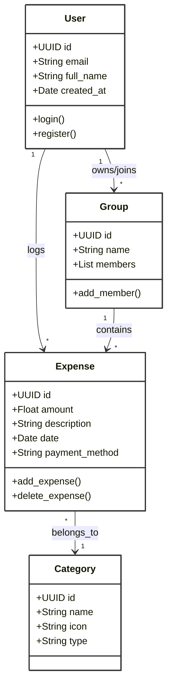
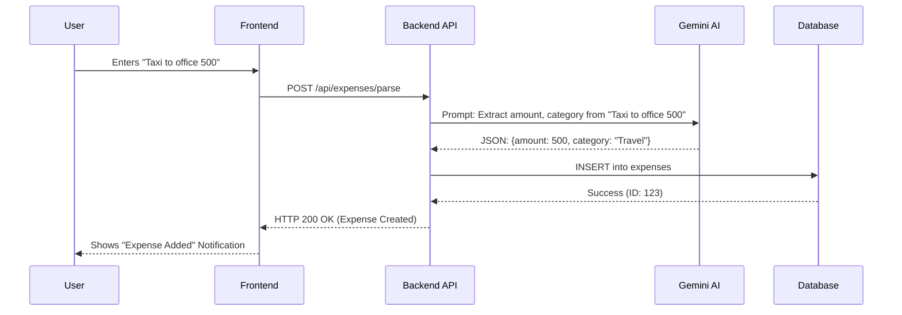
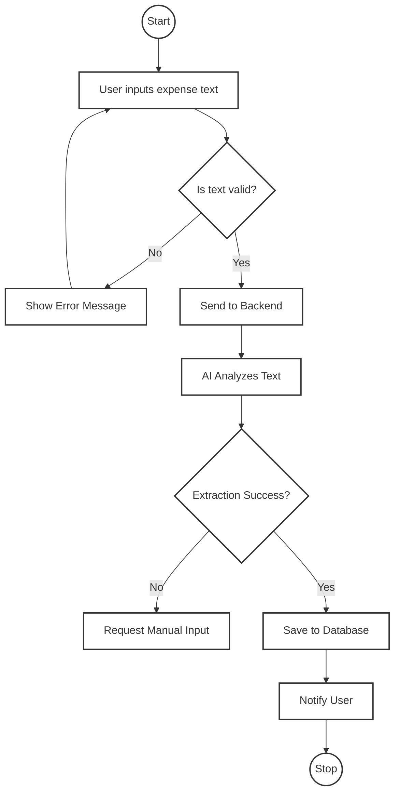
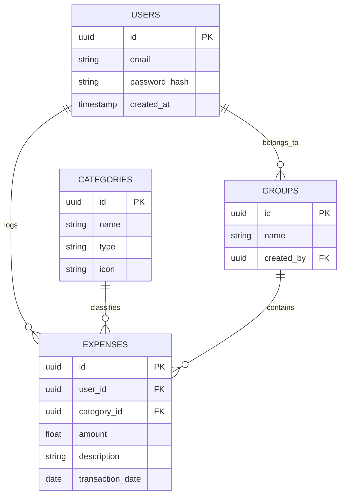

<div align="center">

# PERSONAL FINANCE MANAGER (PFM)

<br><br>

**A PROJECT REPORT**

<br>

**SUBMITTED BY**

**[Student Name]**

**TU Registration No.: [Reg. No.]**

**Campus Roll No.: [Roll No.]**

<br><br>

**SUBMITTED TO**

**Department of Computer Science and Information Technology**

**[Campus/College Name]**

**Tribhuvan University**

<br><br>

In partial fulfillment of the requirements for the degree of

**Bachelor of Science in Computer Science and Information Technology (B.Sc. CSIT)**

<br><br>

**[Month, Year]**

</div>

---

<div align="center">

**TRIBHUVAN UNIVERSITY**

**INSTITUTE OF SCIENCE AND TECHNOLOGY**

**[CAMPUS/COLLEGE NAME]**

**DEPARTMENT OF COMPUTER SCIENCE AND INFORMATION TECHNOLOGY**

<br><br>

**SUPERVISOR'S RECOMMENDATION**

</div>

I hereby recommend that this project report prepared by **[Student Name]** entitled "**Personal Finance Manager (PFM)**" be accepted as a partial fulfillment of the requirements for the degree of B.Sc. in Computer Science and Information Technology. In my best knowledge, this is an original work in computer science.

<br><br><br>

................................................

**[Supervisor Name]**

Supervisor

Department of Computer Science and Information Technology

[Campus Name]

[Date]

---

<div align="center">

**TRIBHUVAN UNIVERSITY**

**INSTITUTE OF SCIENCE AND TECHNOLOGY**

**[CAMPUS/COLLEGE NAME]**

**DEPARTMENT OF COMPUTER SCIENCE AND INFORMATION TECHNOLOGY**

<br><br>

**LETTER OF APPROVAL**

</div>

We certify that we have examined this project report entitled "**Personal Finance Manager (PFM)**" submitted by **[Student Name]** and reviewed the candidate's project work. We recommend that the project report be accepted as a partial fulfillment of the requirements for the degree of B.Sc. in Computer Science and Information Technology.

<br><br>

**Evaluation Committee**

<br>

................................................            ................................................

**[Supervisor Name]**                                      **[Head of Department Name]**

Supervisor                                                 Head of Department

<br><br>

................................................

**[External Examiner Name]**

External Examiner

<br>

Date: ................................................

---

<div align="center">

**ACKNOWLEDGEMENT**

</div>

I would like to express my sincere gratitude to my supervisor, **[Supervisor Name]**, for their invaluable guidance, encouragement, and support throughout the course of this project. Their insights and feedback were instrumental in shaping the direction of this work.

I am also grateful to **[Head of Department Name]**, Head of the Department of Computer Science and Information Technology, for providing the necessary facilities and resources.

I would like to thank my friends and family for their unwavering support and motivation during the development of this project.

<br>

**[Student Name]**

[Date]

---

<div align="center">

**ABSTRACT**

</div>

Managing personal finances is a crucial aspect of modern life, yet many individuals struggle with tracking expenses due to the tedious nature of manual entry and categorization. The **Personal Finance Manager (PFM)** is a hybrid mobile and web application designed to simplify expense tracking through the power of Natural Language Processing (NLP) and Artificial Intelligence.

The system allows users to log expenses using natural language phrases (e.g., "spent 500 on lunch"), which are then parsed and categorized automatically by Google's Gemini AI. Built using a robust tech stack comprising **React.js** for the frontend, **FastAPI (Python)** for the backend, **Supabase (PostgreSQL)** for the database, and **Capacitor** for mobile deployment, the application offers a seamless cross-platform experience. Key features include intelligent expense categorization, multi-group management for shared expenses, real-time financial analytics, and a voice-enabled interface. This project demonstrates the effective integration of modern web technologies and Generative AI to solve real-world financial management problems.

<br>

**Keywords:** *Personal Finance, Expense Tracking, Natural Language Processing, Artificial Intelligence, React, FastAPI, Gemini API.*

---

<div align="center">

**TABLE OF CONTENTS**

</div>

1. **Introduction** ............................................................................................ 1
    1.1 Background ........................................................................................ 1
    1.2 Problem Statement ........................................................................... 2
    1.3 Objectives ........................................................................................... 2
    1.4 Scope and Limitations ....................................................................... 3
    1.5 Report Organization .......................................................................... 3

2. **Literature Review** ...................................................................................... 4
    2.1 Existing Systems ................................................................................ 4
    2.2 Gap Analysis ...................................................................................... 5

3. **System Methodology** ................................................................................ 6
    3.1 Software Development Life Cycle (SDLC) ........................................ 6
    3.2 Requirement Analysis ........................................................................ 7
        3.2.1 Functional Requirements ...................................................... 7
        3.2.2 Non-Functional Requirements .............................................. 8
    3.3 Feasibility Study ................................................................................ 9

4. **System Design** ......................................................................................... 10
    4.1 System Architecture .......................................................................... 10
    4.2 Use Case Diagram ............................................................................ 11
    4.3 Class Diagram .................................................................................. 12
    4.4 Sequence Diagram ............................................................................ 13
    4.5 Activity Diagram .............................................................................. 14
    4.6 Database Design (ER Diagram) ....................................................... 15
    4.7 UI/UX Design ................................................................................... 16

5. **Implementation and Testing** .................................................................... 17
    5.1 Tools and Technologies Used ........................................................... 17
    5.2 Implementation Details ..................................................................... 18
    5.3 Testing Strategy ................................................................................ 22
        5.3.1 Unit Testing ........................................................................... 22
        5.3.2 Integration Testing ................................................................ 23

6. **Conclusion and Future Enhancements** .................................................. 24
    6.1 Conclusion ........................................................................................ 24
    6.2 Future Enhancements ....................................................................... 24

**References** .................................................................................................... 25
# CHAPTER 1: INTRODUCTION

## 1.1 Background

In an era of digital payments and complex financial obligations, effective management of personal finances has become a necessity. Individuals often struggle to keep track of their daily expenses, leading to poor financial health and lack of savings. Traditional methods of expense tracking, such as manual ledgers or spreadsheets, are time-consuming and prone to human error. Even mobile applications often require tedious manual entry of date, amount, category, and description for every transaction, leading to user drop-off.

The **Personal Finance Manager (PFM)** is designed to address these challenges by leveraging the power of Artificial Intelligence (AI) and Natural Language Processing (NLP). By allowing users to input expenses in natural language—as if they were texting a friend—the system removes the friction of manual data entry. Integrated with Google's Gemini API, the system intelligently understands the context of the expense, categorizes it automatically, and stores it for analysis. This project aims to democratize financial literacy and ease of management through a modern, user-friendly interface accessible on both web and mobile platforms.

## 1.2 Problem Statement

Despite the availability of numerous financial management tools, several key issues persist:

1.  **High Data Entry Friction:** Users find it cumbersome to manually select categories, dates, and payment modes for every small transaction.
2.  **Lack of Intelligent Categorization:** Most apps rely on rigid, pre-defined rules that fail to understand context (e.g., "coffee with client" might be a business expense, not just "Food").
3.  **Complex Interfaces:** Many financial apps are cluttered with complex charts and features that overwhelm the average user.
4.  **Fragmented Experience:** Users often need separate apps for personal tracking and shared expenses (e.g., splitting bills with roommates).

## 1.3 Objectives

The primary objective of this project is to develop a smart, NLP-powered personal finance management system. The specific objectives are:

1.  **To implement Natural Language Expense Logging:** Enable users to log expenses using simple text commands (e.g., "200 for taxi").
2.  **To automate Expense Categorization:** Utilize Generative AI (Google Gemini) to accurately categorize transactions based on description and context.
3.  **To provide Real-time Analytics:** develop interactive dashboards to visualize spending habits, trends, and budget adherence.
4.  **To support Multi-Group Management:** Facilitate shared expense tracking for families, roommates, or trip groups.
5.  **To ensure Cross-Platform Accessibility:** Deploy the application as a Progressive Web App (PWA) and an Android application.

## 1.4 Scope and Limitations

### 1.4.1 Scope
The scope of the PFM project covers:
*   **User Management:** Secure authentication and profile management.
*   **Expense Tracking:** Adding, editing, and deleting expenses via text or manual input.
*   **AI Integration:** Using Gemini API for parsing and categorization.
*   **Visualization:** Graphical representation of financial data.
*   **Platform:** Web browsers and Android devices.

### 1.4.2 Limitations
*   **Internet Dependency:** The AI features require an active internet connection to communicate with the Gemini API.
*   **Language Support:** Currently, the NLP parser is optimized for English and Hinglish (Hindi-English mix) and may not support other regional languages effectively.
*   **Bank Integration:** The system does not currently support automatic SMS reading or direct bank account syncing due to security and privacy constraints.

## 1.5 Report Organization

This project report is organized into six chapters:
*   **Chapter 1** introduces the project, its background, problem statement, and objectives.
*   **Chapter 2** reviews existing literature and separation systems.
*   **Chapter 3** outlines the system methodology and requirements.
*   **Chapter 4** details the system design, including architecture and UML diagrams.
*   **Chapter 5** describes the implementation details and testing strategies.
*   **Chapter 6** concludes the report with future enhancements.
# CHAPTER 2: LITERATURE REVIEW

## 2.1 Existing Systems

Several personal finance management applications exist in the market, each offering various features for expense tracking and budgeting. Some of the most popular ones include:

### 2.1.1 Mint (Intuit)
Mint was one of the most popular PFM tools, offering automatic bank synchronization, budgeting, and credit score tracking.
*   **Strengths:** Comprehensive financial overview, automated syncing.
*   **Weaknesses:** Recently discontinued/migrated to Credit Karma, heavily ad-supported, privacy concerns with bank data.

### 2.1.2 You Need A Budget (YNAB)
YNAB focuses on zero-based budgeting, encouraging users to give every dollar a job.
*   **Strengths:** Excellent proactive budgeting methodology, strong educational resources.
*   **Weaknesses:** Expensive subscription model, steep learning curve for new users, requires manual discipline.

### 2.1.3 Wallet (BudgetBakers)
Wallet provides bank sync and flexible manual tracking with good visualization.
*   **Strengths:** Good analytics, supports multiple currencies.
*   **Weaknesses:** Premium features required for bank sync, UI can be cluttered.

### 2.1.4 Splitwise
Specifically designed for splitting bills and shared expenses.
*   **Strengths:** Excellent for group expenses, intuitive interface.
*   **Weaknesses:** Not a full PFM (lacks personal budgeting, net worth tracking), limited analytics for individual spending.

## 2.2 Gap Analysis

While existing systems are robust, they often suffer from one or more of the following limitations:

1.  **Manual Entry Friction:** Applications that don't support bank sync (or where bank sync fails) require users to manually input every detail using form-based UIs, which is tedious.
2.  **Lack of Natural Language Support:** Very few apps allow users to just "say" or "type" their expense naturally. Most require selecting category, date, account, etc., via dropdowns.
3.  **Cost:** Premium features like bank sync and advanced analytics often come with monthly subscriptions.
4.  **Privacy:** Free apps often monetize user data or show intrusive ads.

**The Proposed System (PFM)** addresses these gaps by:
*   **Eliminating Form Fatigue:** Using NLP to allow users to log expenses as disjointed text phrases (e.g., "paid 500 for taxi").
*   **Smart Categorization:** Leveraging LLMs (Gemini) to infer categories from context, reducing manual classification effort.
*   **Hybrid Approach:** combining personal expense tracking with simple group-splitting features (like Splitwise) in a single app.
*   **Open Architecture:** Being a self-hosted or local-first capable solution that respects user privacy.
# CHAPTER 3: SYSTEM METHODOLOGY

## 3.1 Software Development Life Cycle (SDLC)

For the development of the Personal Finance Manager, the **Agile Methodology** was adopted. Agile is an iterative approach to project management and software development that helps teams deliver value to their customers faster and with fewer headaches.

The development process involved the following phases:
1.  **Planning:** Defining the scope, objectives, and initial backlog of features (e.g., basic expense logging).
2.  **Design:** Creating high-level architecture, database schema, and UI mockups.
3.  **Development (Sprints):**
    *   *Sprint 1:* Setup React frontend and FastAPI backend.
    *   *Sprint 2:* Implement Supabase authentication and database.
    *   *Sprint 3:* Integrate Gemini API for NLP parsing.
    *   *Sprint 4:* Build dashboards and deploy to Android via Capacitor.
4.  **Testing:** Continuous unit testing and integration testing during each sprint.
5.  **Deployment:** Deploying the web version and generating the Android APK.

## 3.2 Requirement Analysis

### 3.2.1 Functional Requirements
Functional requirements define the specific behaviors and functions of the system.
1.  **User Authentication:** Users must be able to sign up, log in, and manage their profiles securely.
2.  **Expense Logging:** The system must allow users to input expenses via text command.
3.  **AI Parsing:** The system must accurately extract amount, category, and description from the input text.
4.  **Dashboard:** Users must see a summary of expenses, category-wise breakdown, and monthly trends.
5.  **Group Management:** Users should be able to create groups and add other users for shared expenses.
6.  **Editing/Deleting:** Users must be able to modify or remove incorrect entries.

### 3.2.2 Non-Functional Requirements
1.  **Performance:** The system should process NLP queries within 3 seconds.
2.  **Scalability:** The database should handle thousands of transactions without significant latency.
3.  **Availability:** The application should be available 99.9% of the time.
4.  **Security:** User data must be encrypted in transit and at rest; API keys must be secured.
5.  **Usability:** The interface should be intuitive and responsive on mobile devices.

## 3.3 Feasibility Study

### 3.3.1 Technical Feasibility
The project utilizes established technologies: React for frontend, Python (FastAPI) for backend, and Supabase for database. The integration of Google's Gemini API is well-documented and supported via official SDKs. Thus, the project is technically feasible.

### 3.3.2 Operational Feasibility
The application is designed to be user-friendly, requiring no special training. The natural language input mimics daily communication (messaging), making it highly adoptable for users of all ages.

### 3.3.3 Economic Feasibility
The development relies on open-source tools (React, FastAPI) and free-tier services (Supabase, Gemini API free tier). The cost of development is primarily time and effort, making it economically viable for a student project or startup MVP.
# CHAPTER 4: SYSTEM DESIGN

## 4.1 System Architecture

The system follows a typical **Client-Server Architecture** with a decoupled frontend and backend. The React frontend communicates with the Python (FastAPI) backend via RESTful APIs. The backend handles business logic, communicates with the Google Gemini API for NLP tasks, and interacts with the Supabase PostgreSQL database for data persistence.

```mermaid
graph TD
    User[User] -->|Interacts via Browser/App| Frontend[React Native / Web Frontend]
    Frontend -->|HTTPS/REST API| Backend[FastAPI Backend]
    Backend -->|SQL Queries| DB[(Supabase PostgreSQL)]
    Backend -->|API Calls (Prompt)| Gemini[Google Gemini AI]
    Backend -->|Auth Tokens| Auth[Supabase Auth]
    
    subgraph "External Services"
        Gemini
        Auth
    end
    
    subgraph "Internal Infrastructure"
        Frontend
        Backend
        DB
    end

    style User fill:#fff,stroke:#333,stroke-width:2px
    style Frontend fill:#fff,stroke:#333,stroke-width:2px
    style Backend fill:#fff,stroke:#333,stroke-width:2px
    style DB fill:#fff,stroke:#333,stroke-width:2px
    style Gemini fill:#fff,stroke:#333,stroke-width:2px
    style Auth fill:#fff,stroke:#333,stroke-width:2px
```

## 4.2 Use Case Diagram

The Use Case diagram illustrates the interactions between the primary actor (End User) and the system.

```mermaid
usecaseDiagram
    actor User as "End User"
    
    package "Personal Finance Manager" {
        usecase "Login / Register" as UC1
        usecase "Add Expense (NLP)" as UC2
        usecase "View Dashboard" as UC3
        usecase "Manage Categories" as UC4
        usecase "Generate Reports" as UC5
        usecase "Create Group" as UC6
    }
    
    User --> UC1
    User --> UC2
    User --> UC3
    User --> UC4
    User --> UC5
    User --> UC6

    classDef white fill:#fff,stroke:#333,stroke-width:2px;
    class UC1,UC2,UC3,UC4,UC5,UC6 white;
```

## 4.3 Class Diagram

The Class Diagram depicts the structure of the system's classes, their attributes, and relationships.



## 4.4 Sequence Diagram

The Sequence Diagram for the "Add Expense" feature shows the flow of messages between objects.



## 4.5 Activity Diagram

The Activity Diagram illustrates the workflow of adding an expense.



## 4.6 Database Design (ER Diagram)

The Entity-Relationship (ER) diagram shows the database schema.



## 4.7 UI/UX Design

The user interface was designed with a "Mobile First" approach, ensuring strict adherence to responsive design principles. 
*   **Color Palette:** A clean, minimal color scheme (using TailwindCSS defaults) with distinct colors for income (green) and expense (red).
*   **Typology:** Sans-serif fonts for readability (Inter/Roboto).
*   **Interaction:** Smooth transitions and loading states for AI operations.
# CHAPTER 5: IMPLEMENTATION AND TESTING

## 5.1 Tools and Technologies Used

The project was implemented using the following set of tools and technologies:

*   **Frontend:** React.js (v18), TailwindCSS (Styling), Recharts (Data Visualization), Capacitor (Mobile Build).
*   **Backend:** Python 3.10+, FastAPI (Web Framework), Uvicorn (ASGI Server), Google Gemini SDK (AI).
*   **Database:** Supabase (PostgreSQL), Supabase Auth.
*   **Version Control:** Git & GitHub.
*   **IDE:** Visual Studio Code.

## 5.2 Implementation Details

### 5.2.1 Backend: NLP Expense Parsing
The core feature of the application is the NLP parser. Below is the Python implementation using FastAPI and Gemini:

```python
# backend/api/expenses.py (Snippet)

@router.post("/parse")
async def parse_expense(text: str):
    """
    Parses natural language text into structured expense data.
    """
    prompt = f"""
    Extract the following details from the text: "{text}"
    - Amount (number)
    - Category (Enum: Food, Travel, Bills, Entertainment, Health, Other)
    - Description (string)
    
    Return JSON format only.
    """
    
    response = model.generate_content(prompt)
    try:
        data = json.loads(response.text)
        return {"status": "success", "data": data}
    except json.JSONDecodeError:
        return {"status": "error", "message": "Failed to parse"}
```

### 5.2.2 Frontend: Expense Context
The frontend manages state using React Context API to ensure data consistency across components.

```javascript
// src/context/ExpenseContext.js (Snippet)

export const ExpenseProvider = ({ children }) => {
    const [expenses, setExpenses] = useState([]);

    const addExpense = async (text) => {
        const parsed = await api.parseExpense(text);
        if (parsed.status === "success") {
            const newExpense = await api.saveExpense(parsed.data);
            setExpenses([newExpense, ...expenses]);
        }
    };

    return (
        <ExpenseContext.Provider value={{ expenses, addExpense }}>
            {children}
        </ExpenseContext.Provider>
    );
};
```

## 5.3 Testing Strategy

### 5.3.1 Unit Testing
Unit tests were written for individual backend functions, particularly the NLP parsing logic, to ensure different text inputs return correct JSON structures.
*   *Test Case 1:* Input "Food 500" -> Expect `{amount: 500, category: "Food"}`.
*   *Test Case 2:* Input "Taxi 200" -> Expect `{amount: 200, category: "Travel"}`.

### 5.3.2 Integration Testing
Integration tests verified the communication between the React frontend and the FastAPI backend. We ensured that data sent from the form is correctly received by the API and stored in the Supabase database.

### 5.3.3 User Acceptance Testing (UAT)
The application was tested by a small group of users to verify the accuracy of the AI categorization. Feedback was collected to improve the prompt engineering for edge cases (e.g., ambiguous terms).
# CHAPTER 6: CONCLUSION AND FUTURE ENHANCEMENTS

## 6.1 Conclusion

The **Personal Finance Manager (PFM)** project successfully demonstrates the potential of integrating Generative AI into everyday utility applications. By simplifying the expense logging process through Natural Language Processing, the system addresses the primary pain point of traditional finance apps—manual data entry friction. The use of a modern tech stack (React, FastAPI, Supabase) ensures the application is scalable, responsive, and maintainable.

The project met functionality objectives, including:
*   Accurate parsing of expense text using Google Gemini.
*   Real-time data visualization for financial insights.
*   Secure user authentication and data storage.

This system provides a robust foundation for personal financial management and showcase the practical application of Large Language Models (LLMs) in software engineering.

## 6.2 Future Enhancements

While the current system is functional, several enhancements can be made in future iterations:

1.  **Bank SMS Integration:** Automate expense logging by reading transaction SMS messages (Android only).
2.  **OCR for Receipts:** Implement Optical Character Recognition (OCR) to allow users to scan physical receipts.
3.  **Budget Alerts:** Add push notifications when users exceed their set category budgets.
4.  **Investment Tracking:** Extend the system to track investments (Stocks, Mutual Funds) alongside daily expenses.
5.  **Offline Mode:** Enhance the PWA capabilities to allow offline logging, syncing when the internet is restored.

---

# REFERENCES

1.  **FastAPI Documentation.** (n.d.). *FastAPI Framesork.* Retrieved from https://fastapi.tiangolo.com/
2.  **React Documentation.** (n.d.). *React - A JavaScript library for building user interfaces.* Retrieved from https://reactjs.org/
3.  **Google Cloud.** (2024). *Gemini API Overview.* Retrieved from https://ai.google.dev/
4.  **Supabase.** (n.d.). *The Open Source Firebase Alternative.* Retrieved from https://supabase.com/
5.  **Sommerville, I.** (2011). *Software Engineering* (9th ed.). Addison-Wesley.
6.  **Pressman, R. S.** (2014). *Software Engineering: A Practitioner's Approach* (8th ed.). McGraw-Hill Education.
