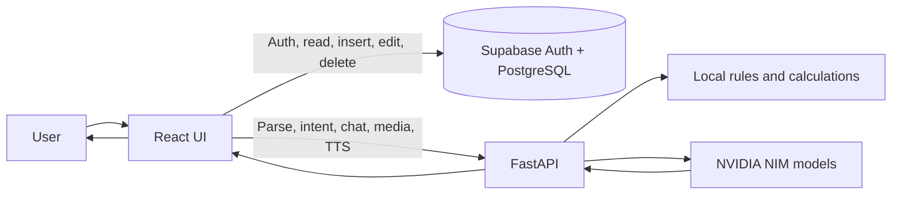
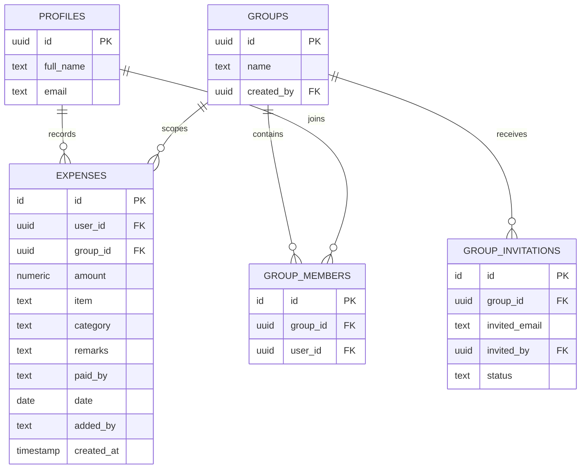
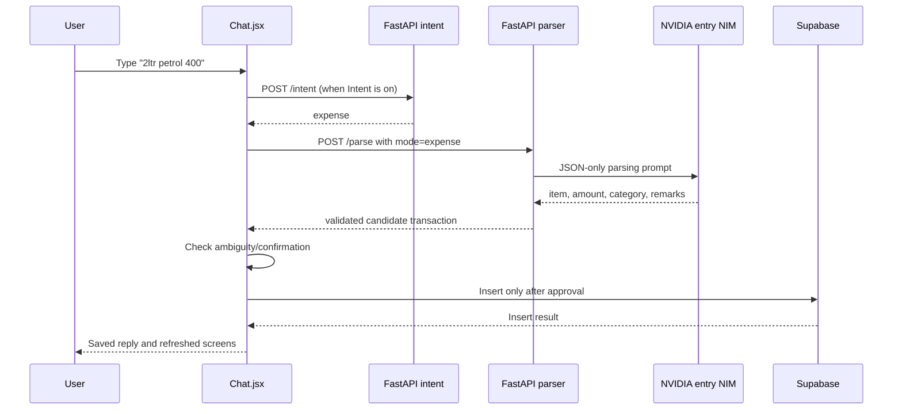

# PFM: How It Works from Frontend to Backend to AI

This document explains the system that is implemented in this repository. It is written in two layers: first the simple mental model, then the code-level details.

Last reviewed against the source tree: 2026-09-13.

## 1. The simple mental model

PFM has two main data paths:

1. **The data path:** React reads and writes financial records directly in Supabase.
2. **The AI path:** React sends text, images, audio, and already-fetched financial rows to FastAPI. FastAPI cleans the input, calculates facts, calls NVIDIA NIM when useful, and sends the result back. FastAPI does not save transactions.

The most important idea is this:

> The AI suggests or explains. The frontend decides whether a transaction is safe to save, and then the frontend inserts it into Supabase.



## 2. What runs where

| Layer | Implemented technology | Main responsibility |
|---|---|---|
| Browser UI | React 18, TailwindCSS, Recharts, Axios | Screens, local state, media capture, calling Supabase and FastAPI |
| Mobile UI | Capacitor 6 Android WebView | Packages the same React build as an Android app |
| API server | FastAPI + Uvicorn/Gunicorn | NLP orchestration, grounded finance answers, media understanding, voice synthesis |
| Database/auth | Supabase PostgreSQL + Supabase Auth | User sessions, profiles, expenses, groups, memberships, invitations |
| AI provider | NVIDIA NIM through an OpenAI-compatible API | Entry parsing, intent classification, multimodal understanding, finance-answer generation |
| Production edge | Nginx | Serves the built React files and proxies `/api`, `/health`, and `/ws` to FastAPI |

The browser app is started by Create React App. `src/index.js` mounts `App` into `#root`. `App.js` uses React state for the selected tab, logged-in user, selected group, and the quick-add modal. The only URL routes currently defined are `/` and `/reset-password`; Chat, Expenses, Income, Loans, and Analytics are tabs controlled by `activeTab`, not separate browser routes.

Useful entry points are [`src/index.js`](../src/index.js), [`src/App.js`](../src/App.js), [`backend/main.py`](../backend/main.py), and [`nginx/default.conf`](../nginx/default.conf).

## 3. Application startup and login

### Frontend startup

1. `src/index.js` creates the React root.
2. `App` mounts `ThemeProvider`, `ToastProvider`, and the router.
3. `initializeMobile()` applies mobile-specific setup when running inside Capacitor.
4. `supabase.auth.getSession()` checks whether a session already exists.
5. `supabase.auth.onAuthStateChange()` keeps the React `user` state synchronized with login, logout, and verification changes.
6. While the session is being checked, PFM shows a loading screen. If there is no user, it renders `Auth`; otherwise it renders `MainLayout`.

### Authentication

Authentication is handled directly by Supabase in [`src/components/Auth.jsx`](../src/components/Auth.jsx):

- Sign-up calls `supabase.auth.signUp({ email, password })`.
- Sign-in calls `supabase.auth.signInWithPassword(...)`.
- Signup/email verification uses Supabase `verifyOtp`.
- Password reset uses Supabase email OTP and then `updateUser({ password })`.
- A demo button creates a local mock user with id `demo`; it does not create a Supabase account.

The backend does not currently validate a Supabase access token. Its AI endpoints accept the user name, user id, and transaction rows supplied by the browser. Supabase Row Level Security may still protect database operations, but no SQL policy or migration files are present in this repository, so that cannot be verified from the code alone.

## 4. The Supabase data model used by the frontend

There is no schema file in the repository. The following model is inferred from the Supabase queries in the React code.



All three financial screens use the same `expenses` table. The category changes how a row is interpreted:

| Stored row | Amount convention | Where it appears |
|---|---:|---|
| Normal expense | Positive | Expenses and analytics |
| Income | Negative and/or category `Income` | Income and analytics |
| Loan given/repayment | Positive and category `Loan` | Loans |
| Loan received/borrowed | Negative and category `Loan` | Loans |

When Chat saves a parsed transaction, [`App.js`](../src/App.js) adds the current date, current user id, display name in `added_by`, and `group_id` when a group is selected. The AI does not choose the saved date.

## 5. Personal versus group workspace

`currentGroup` is held in React state and persisted in `localStorage` under `pfm_current_group`.

- **Personal workspace:** queries filter `user_id = current user` and `group_id IS NULL`.
- **Group workspace:** queries filter `group_id = selected group`.

`GroupManager` talks directly to Supabase to list memberships, create groups, add the creator to `group_members`, list invitations, accept/decline invitations, invite by email, leave a group, and delete a group with its dependent rows. It also syncs the current user's display name to `profiles` through [`src/utils/profile.js`](../src/utils/profile.js).

When a group is selected, Chat sends the group name and the currently loaded group rows to FastAPI. This is how the AI knows whether it is answering about the personal workspace or a shared group.

## 6. Frontend screens and their data flow

`App.js` mounts these active views:

- `Chat`: AI questions and transaction entry.
- `Table`: normal expenses; `ResponsiveTable` is an older/alternate table implementation and is not mounted by `App.js`.
- `Income`: rows whose category is `Income`.
- `Loans`: rows whose category is `Loan`, with positive/negative direction filters.
- `EnhancedAnalytics`: client-side totals, charts, moving average, and budget suggestions.

The table, income, and loan components each query Supabase themselves. They expose a `refresh()` method through `forwardRef`; after Chat inserts rows, `App.handleExpenseAdded()` calls those refresh methods.

The app does not contain a Supabase Realtime subscription for expense changes. Updates are therefore visible after a manual refresh, a tab/component reload, or the explicit refresh calls after a Chat insert.

### Analytics

`EnhancedAnalytics` reads the selected personal/group rows from Supabase and calculates in the browser:

- expense total, income total, balance, loan-out, and loan-in;
- category totals and daily totals;
- a simple seven-day moving average in [`src/utils/algorithms.js`](../src/utils/algorithms.js);
- a greedy budget optimizer that cuts discretionary categories by up to 50% first, then essential categories by up to 10%.

The active analytics page does not ask an AI model to calculate these charts. The old `Analytics.jsx` component is present but is not used by `App.js`.

## 7. Complete FastAPI endpoint map

FastAPI registers [`backend/api/expenses.py`](../backend/api/expenses.py) under `/api/expenses` and also registers the same router once without a prefix for legacy compatibility.

| Endpoint | Input | Result |
|---|---|---|
| `POST /api/expenses/parse` | Text + mode `expense`, `income`, or `loan` | Structured candidate transactions and a reply |
| `POST /api/expenses/intent` | Text + current UI mode | `chat`, `expense`, `income`, or `loan`; may request confirmation |
| `POST /api/expenses/media/understand` | Base64 JPG/PNG/WAV | Image facts/transactions or audio transcript |
| `POST /api/expenses/chat` | Query, rows, group info, recent conversation | Grounded natural-language answer |
| `POST /api/expenses/voice/synthesize` | Answer text | `audio/wav` bytes from NVIDIA Magpie TTS |
| `POST /api/expenses/budget-optimizer/explain` | Computed optimizer numbers | Deterministic explanation |
| `POST /api/auth/send-reset-otp` | Email | In-memory test OTP |
| `POST /api/auth/verify-reset-otp` | Email + OTP | OTP verification result |
| `GET /health` | None | Health status |
| `WS /ws` | Text messages | Broadcasts `Message: ...` to connected sockets |

The frontend currently uses the `/api/expenses` AI routes and does not use the backend OTP endpoints or WebSocket. The password reset UI uses Supabase directly.

## 8. Typed expense/income/loan entry: the complete path

Suppose the user types `2ltr petrol 400` in the Expense tab.



### Step A: frontend validation and intent

`Chat.handleSubmit()` first puts the user message into local chat state, clears the composer, and creates an `AbortController` so the request can be cancelled.

If automatic Intent is enabled, the frontend calls `/api/expenses/intent`. The backend first uses cheap rules. Clear high-confidence input does not need an AI call. A question such as `how much did I spend this month?` stays in Chat even though it may contain a number. A command such as `can you add coffee 80?` is classified as an expense.

The classifier intentionally refuses to guess ambiguous transfers. For example, `Hari gave me 6000` can mean income, a gift, a loan, or repayment. It returns a confirmation request instead of allowing an automatic save.

If intent detection is disabled, the selected tab is used. If the classifier request fails, the code falls back to `chat` so a failed classifier cannot silently cause a write.

### Step B: backend parsing and AI extraction

`NLPService.parse_expense()` in [`backend/services/nlp_service.py`](../backend/services/nlp_service.py) uses this order:

1. Normalize the selected mode.
2. Normalize units such as `1.5k`, `10 lakh`, and `1.25 cr` into numbers. A bare `l` is intentionally not treated as lakh because it commonly means litre.
3. Correct known typos such as `petril -> petrol`, `cofee -> coffee`, and `biriyani -> biryani`.
4. If NVIDIA NIM is configured, call the low-latency entry model with a strict JSON-only prompt.
5. Parse the model JSON and validate every record.
6. If the model is unavailable or its output is not usable, use the local rule parser and quantity-aware extractors.

The entry prompt tells the model that the selected tab is authoritative and asks it to return records like:

```json
{
  "expenses": [
    {
      "amount": 400,
      "item": "Petrol",
      "category": "Transport",
      "remarks": "2 litres petrol",
      "paid_by": null,
      "needs_confirmation": false,
      "transaction_type": "expense"
    }
  ]
}
```

The prompt also teaches the model that quantity numbers are not prices:

- `2ltr petrol 400` = one transaction for Rs.400.
- `rice 2kg 300` = one transaction for Rs.300.
- `5kg rice for 10 people 5000` = one transaction for Rs.5000.
- `rice 300 and petrol 500` = two transactions.

### Step C: model output is normalized and guarded

The backend does not blindly trust model JSON. `_normalise_nim_transactions()` and related helpers:

- strip commas and non-numeric characters from amounts;
- reject zero or missing amounts;
- reject generic items such as “expense entry” or “money”;
- clean item names and remarks;
- allow only short, readable category labels;
- force income amounts negative and category `Income`;
- force loan category `Loan` and preserve the counterparty in `paid_by`;
- force ordinary expense amounts positive;
- remove duplicate media transactions;
- set `needs_confirmation` for uncertain loans or unknown expense categories.

The code also checks the expected number of monetary amounts. This prevents a model from turning the `2` in `2ltr petrol 400` into a second transaction. Local category guards give purpose words such as `maintenance`, `repair`, and `cleaning` priority over an object keyword.

The non-AI `ExpenseParser` contains regex patterns for loans, income, and ordinary entries, a large English/Hinglish/Nepali keyword dictionary, typo correction, person detection, and deterministic category selection. It is the reliability fallback, not merely a development stub.

### Step D: frontend confirmation and save

The backend returns candidates; `Chat.jsx` decides what happens next:

- An unknown expense category opens category buttons.
- An ambiguous loan opens direction choices such as lent, borrowed, paid back, or received back.
- An image or receipt always opens an editable review card before saving.
- A clear typed entry calls `onExpenseAdded()` immediately.

`App.handleExpenseAdded()` maps the candidates to database columns and performs one bulk `supabase.from('expenses').insert(expenseData)` call. Only after that does it refresh Expenses, Income, and Loans.

## 9. Chat questions and the “RAG” system

The Chat path is not a traditional embedding/vector database. In this project, RAG means:

1. Retrieve/filter the relevant rows with deterministic Python code.
2. Calculate exact financial facts.
3. Give those facts to an LLM as context so it can explain them conversationally.

### What the frontend sends

For a Chat question, `Chat.jsx`:

- gets a fresh Supabase user session;
- loads up to 1,000 rows for the active personal/group workspace;
- sends the query, user name, group name, rows, `voice_mode`, and the last eight user/assistant messages to `/api/expenses/chat`.

The conversation history helps resolve follow-ups, but it is not treated as financial truth.

### What `RAGService` retrieves

`RAGService` first resolves a date range with [`backend/utils/date_periods.py`](../backend/utils/date_periods.py): today, yesterday, this/last week, this/last month, this/last year, named months, explicit years, and rolling periods such as `last30days`.

It then calculates facts from the supplied rows:

- personal expenses = positive rows excluding `Income` and `Loan`;
- income = income-category rows or negative non-loan inflows;
- loans = category `Loan`, split by positive and negative amount;
- total expense, total income, net balance, largest/smallest transaction;
- category totals and counts;
- group-member totals using `added_by`;
- monthly totals inside the requested scope;
- item/category matches and person spending matches.

For simple questions, the deterministic fallback answers directly. For example, a category question can be answered with an exact sum without calling an LLM. This protects against hallucinated totals and is why the tests assert that some period/category questions must not call NIM.

If the question needs explanation, advice, or more flexible language, the service builds a prompt containing authoritative retrieved facts, scoped summaries, category/year/month breakdowns, transactions, group-member totals, and loan details. The full chat model is told:

- use only supplied facts for personal financial claims;
- apply the requested date scope;
- combine explicitly requested categories;
- use `added_by` for group spending, not `paid_by`;
- use the loan section for debt questions;
- never invent transactions, balances, goals, or rates.

The model is `NVIDIA_NIM_MODEL` for text and `NVIDIA_NIM_VOICE_CHAT_MODEL` for live voice answers. Voice answers get a smaller token budget and must be one or two short sentences.

The response passes through `final_answer_only()`, which removes `<think>` blocks, trims labels such as `Final answer:`, and rejects likely leaked reasoning. If NIM is unavailable or errors, the service falls back to deterministic `RAGService.grounded_fallback_answer()` and then to the older [`ExpenseAnalyzer`](../backend/services/expense_analyzer.py) rule-based query processor.

## 10. Image understanding

Image flow:

1. The user selects JPG/PNG in Chat. The browser enforces a 5 MB limit and creates a small preview.
2. On submit, the original file is converted to base64 and sent to `/api/expenses/media/understand`.
3. FastAPI validates media type, base64, size, and file signature.
4. NVIDIA's multimodal model receives an image data URL plus a JSON-only instruction.
5. The prompt asks for an intent, factual message, visible context, and transactions only when both item/purpose and amount are clear.
6. It warns against double-counting receipt subtotal, tax, and total, and asks for either reliable line items or one receipt total.
7. `_normalise_media_transactions()` validates amounts, categories, confidence, item names, duplicates, and confirmation state.
8. Chat routes validated transactions to the appropriate mode and presents an editable review card. The user can edit item, remarks, category, or cancel. Saving still happens through Supabase from the frontend.

If the image is a question or not a financial record, the backend returns no transactions and routes it as Chat rather than writing anything.

## 11. Voice and audio understanding

There are two voice experiences.

### Live voice conversation

When the user opens the voice session, Chat prefers the browser's `SpeechRecognition`/`webkitSpeechRecognition` API. It listens continuously, displays interim text, removes fillers and repeated phrases, and waits about 2.1 seconds of silence before submitting the transcript as a normal Chat request with `voice_mode: true`.

If browser speech recognition is unavailable or fails with a network/audio-capture error, Chat uses the Web Audio API instead. It captures mono PCM with an `AudioContext`, detects speech using RMS volume, automatically stops after silence, resamples to at most 16 kHz, and creates a valid WAV file.

The WAV goes through the audio attachment path: `/media/understand` sends it to the multimodal NIM, which returns a transcript. That transcript is then routed through the existing intent/chat/entry flow.

After a voice answer:

1. Chat calls `/voice/synthesize` with the answer text.
2. The backend removes Markdown, changes `Rs.` to “rupees”, keeps at most three sentences/70 words, and calls NVIDIA Magpie TTS.
3. FastAPI returns WAV audio.
4. The browser plays the WAV and automatically listens for the next turn.
5. If neural TTS fails, the browser uses `speechSynthesis` as a native fallback.

### Voice attachment

The user can record an audio attachment without opening a live session. The browser creates a WAV file, Chat sends it to multimodal NIM for transcription, and the transcript is treated like typed input. This means one parser and one confirmation policy are reused for typed, image, and audio entries.

## 12. Configuration and deployment

Frontend-safe values are read from `REACT_APP_*` variables and embedded into the browser build. `public/config.js` can provide a runtime API base URL. In local development, the Create React App proxy in [`src/setupProxy.js`](../src/setupProxy.js) forwards API calls to `localhost:8000`.

Backend-only values are loaded from `backend/.env`, especially:

- `NVIDIA_API_KEY`;
- `NVIDIA_NIM_MODEL` for grounded text answers;
- `NVIDIA_NIM_ENTRY_MODEL` for fast transaction parsing and low-confidence intent classification;
- `NVIDIA_NIM_MULTIMODAL_MODEL` for images and fallback audio transcription;
- `NVIDIA_NIM_VOICE_CHAT_MODEL` for short live voice answers;
- `NVIDIA_NIM_TTS_URL` and `NVIDIA_NIM_TTS_VOICE` for Magpie speech;
- `NVIDIA_NIM_MAX_TOKENS` for text chat;
- Supabase and server port values.

The Docker image builds React first, copies the build into a Python runtime image, and starts Gunicorn/FastAPI. In the compose deployment, Nginx serves that build and proxies to the backend container. `render.yaml` deploys FastAPI directly with Gunicorn.

## 13. Important implementation realities and caveats

- **FastAPI is not the database layer today.** The Python Supabase dependency and environment variables exist, but the backend code does not query Supabase. The browser supplies the rows used by AI.
- **AI calls are not authenticated by the backend.** `/chat` accepts `user_id`, `user_email`, and rows as ordinary request fields. For a production security boundary, FastAPI should verify the Supabase JWT and retrieve authorized rows itself.
- **The browser controls the insert decision.** This is good for confirmation UX, but the backend does not provide a server-side transaction write or audit boundary.
- **No schema/migration/RLS policy is included.** The database structure and access policies must be checked in the Supabase project.
- **Some documentation is older than the implementation.** In particular, the active analytics page is client-side, the RAG service is deterministic retrieval plus prompting rather than vector search, and there is no expense Realtime subscription in the source.
- **The current date is written on save.** Natural-language dates are used for questions, but parsed transaction dates are not currently persisted from the user's text.
- **The backend CORS policy is wide open** (`allow_origins=["*"]`), and the test OTP endpoint returns the OTP in its response. These are development conveniences that need tightening before production.
- **Configuration defaults differ by file.** For example, `backend/.env.example` and `render.yaml` specify different entry-model defaults. The actual environment variable wins at runtime.

## 14. A short “read the code in this order” guide

For someone new to the project, the fastest path is:

1. [`src/App.js`](../src/App.js): startup, auth gate, tabs, saving.
2. [`src/components/Chat.jsx`](../src/components/Chat.jsx): all user-to-AI flows and confirmation logic.
3. [`backend/api/expenses.py`](../backend/api/expenses.py): request/response boundary.
4. [`backend/services/nlp_service.py`](../backend/services/nlp_service.py): parsing, intent, media, TTS, and orchestration.
5. [`backend/services/rag_service.py`](../backend/services/rag_service.py): retrieval, exact facts, prompts, and fallback answers.
6. [`backend/services/expense_analyzer.py`](../backend/services/expense_analyzer.py): deterministic analytics/query fallback.
7. [`src/components/Table.jsx`](../src/components/Table.jsx), [`Income.jsx`](../src/components/Income.jsx), [`Loans.jsx`](../src/components/Loans.jsx), and [`EnhancedAnalytics.jsx`](../src/components/EnhancedAnalytics.jsx): how saved rows are displayed and summarized.

